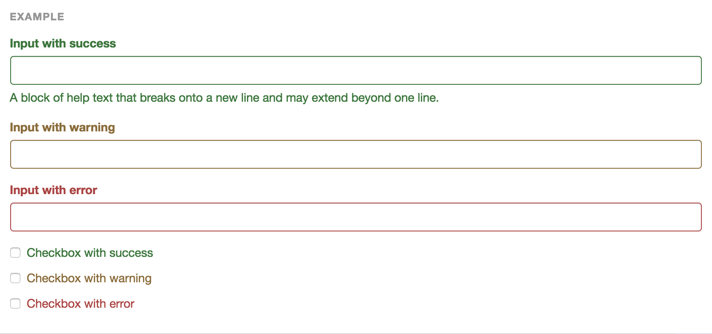
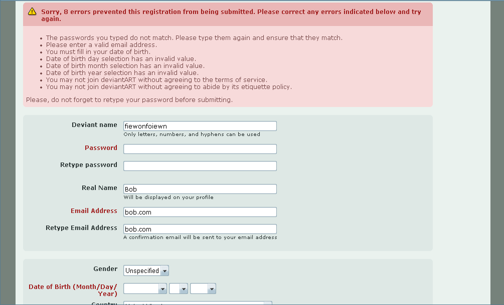

#表单验证
###视觉展现
首先，系统应该通过良好的视觉展现提示用户表单验证的结果，（颜色+提示语）

点击查看[Bootstrap实现](http://getbootstrap.com/css/#forms-control-validation)

上面这种方式称之为Inline Validation,特点是错误信息与控件相集成，更加直观。作为对比，我们可以看一下在Web2.0时代之前的表单校验样子。


~~在任何项目内都不要再用这种方式了！~~

当然，还有其他的提示方式，比如弹出信息等等，但在大多数情况下，我们都应该采用[inline的方式](http://alistapart.com/article/inline-validation-in-web-forms)。

###触发
系统根据用户行为来触发表单校验，一般来说，我们需要在以下俩种行为情况下触发表单校验：
1. 表单提交
2. 用户输入后（onChange事件）／控件失去焦点（onBlur事件）。

在极少数情况下，我们也会在表单初始化过程中来进行校验。

###注意事项
* 提交后的表单校验，应该一次性验证所有的表单字段并把错误校验返回给用户，不要遇到一个错误就停止校验。
* 校验失败后，应该把光标焦点自动设置为第一个校验失败的控件上(focus方法)，如控件未在当前页面，需要scrollTo到这个控件。
* 一定要在前端和后端同时实现验证过程！一定要在前端和后端同时实现验证过程！一定要在前端和后端同时实现验证过程！前端的验证是为了提高用户体验、服务器端的验证是为了数据一致性和安全。

###实现
校验错误信息的展现：
1. 可以通过Bootstrap的inline方式展现，参见本文第一部分《视觉展现》
2. 也可以通过提示信息的方式。

校验的JS实现：
* 基于Angular2的程序，可以结合[Form Module](https://angular.cn/docs/ts/latest/guide/forms.html)来完成校验，但是在写这行字的时候，我们还没有很好的最佳实践来使用Angular2覆盖所有情况的校验，比如唯一性校验。

```
import { FormGroup, FormBuilder, Validators } from '@angular/forms'
```
* 如果是基于jQuery的前端程序，那么[jQuery Validation Plugin](https://jqueryvalidation.org/)是很好的选择。

###正则表达式
[看这里](regular_experssions_.md)