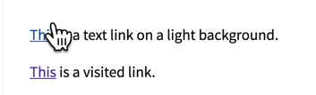

### 链接的故事

###样式
* 在正常情况下，全站的链接应该采用统一的样式（包括字体、字号、颜色）

* 所有的超链接都应该实现，当鼠标移到链接上后，显示可点击的光标。


```
//一般来说，默认的cursor:auto就可以了
a{
    cursor: auto;
}

//万无一失的做法，比如当你的a标签没有设置href属性
a{
    cursor: pointer;
}

```

* 不要忘记定义被访问过的链接的样式(a:visited)。

* 在大部分情况下，超链接都应该显示为带有下划线的样式。

###行为

* 系统应采用统一的链接打开行为，比如统一为当前页打开，或者打开新页面。（即如何设置target属性），在大部分情况下，我们建议采用本页打开，这也是默认方式。
* 不要即通过href设置链接地址，也通过onClick事件设置链接，会造成混淆或冲突。
* 当你希望通过click事件来处理a标签的链接行为时，请不要设置href="#",这样会导致页面回到顶部。


###注意事项
任何时候都应该使用a标签来实现超链接，不要用下面这种方式，这样会导致部分用户习惯无法进行，比如右击链接。
```
<span onclick="window.href='http://www.wepact.cn/'">点我</span>
```
即便是图片链接，比如logo，也要采用a标签

###什么时候用按钮？什么时候用链接？
* 按钮往往代表着重要的操作或者行为，比如登录、注册、购买、支付、下载等，而且是少量的，想象一下，一个页面有20个按钮的样子。

* 相对来说，一些次要的（比如帮助）、大量的（比如Table中每一行记录最后的编辑和查看链接）、密集排列（比如菜单）的操作或者行为，应该使用链接。